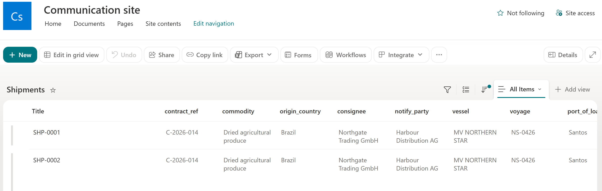
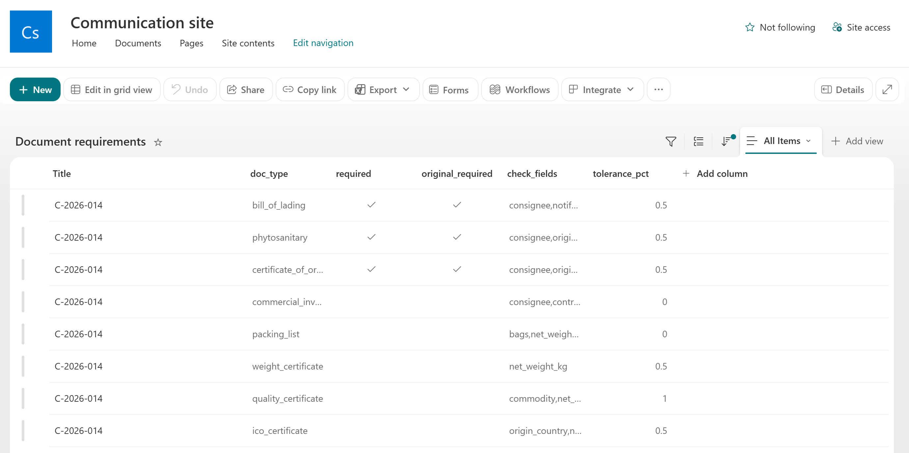
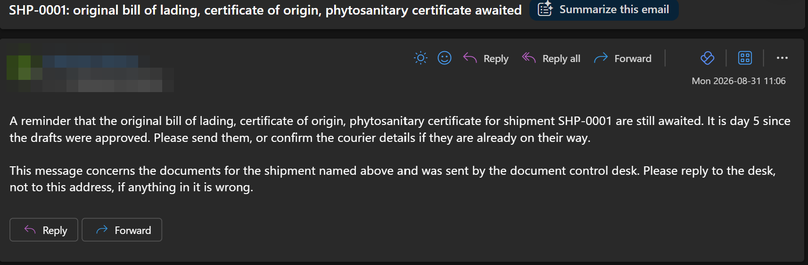
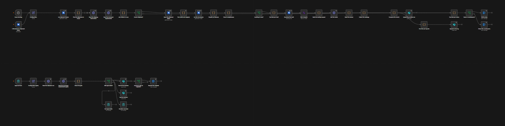

# Shipment Document Control

Checks a shipment's document pack against the shipping instruction, gets the drafts approved by a
named person, then chases the originals until they arrive.

One OneDrive folder per shipment. Every morning, and whenever a file lands, the workflow names
each file from its filename, checks the required documents are present, reads the fields that
matter out of each draft with a model, and compares them with the shipping instruction held on a
SharePoint list - by fixed rules. A named person approves on a form; Outlook carries the request
for originals and the chase.

**The model reads. Fixed rules decide. A person approves.**

It runs on self-hosted n8n: one workflow, 51 nodes, three SharePoint lists, no database.

## What it looks like

The worklist is a SharePoint list. One row per shipment, typed by a person - that row *is* the
shipping instruction, and the workflow writes only the status columns beside it:



Which documents a contract needs is data, not nodes. One row per document type: whether it is
required, whether an original must follow, which fields it has to agree with, and the tolerance
for numbers:



When the drafts are approved and the originals go quiet, the counterparty hears about it on a
schedule - a nudge first, then an escalation with your manager copied:



The whole thing on the n8n canvas - the scan across the top, the approval gate below:



## What this is not

Read this before anything else.

- **Not a document authoring tool.** It checks documents somebody else produced against values
  you typed. It writes no bill of lading and fills no certificate.
- **Not a letter of credit presentation, customs filing or freight booking system.** It tells you
  whether the pack is complete and consistent; presenting it is your job.
- **Not an OCR archive.** Originals are checked for presence in the folder, not read.

Every notice that leaves the company carries a disclaimer you control, and the one message that
quotes what the model read is marked as such. [SCOPE.md](SCOPE.md) is the list of limits, by name.

## How it works

```
scan      every morning, and within minutes of a file landing:
            list the shipment folders, pair each with its row and its contract's
            requirement rows, name the files, check what is present (no model),
            read the present drafts (model), compare with the instruction (rules),
            write the worklist row, log the change, tell whoever needs telling
gate      a person approves or rejects on a form; approve records who and when,
            asks the counterparty for the originals, and starts the chase clock
chase     nudge after three days, escalate with a cc after seven, stop when the
            originals folder has the files
```

The filename decides what a document is, through an alias table: `BL`, `HBL`, `bill of lading`;
`phyto`; `COO`; `invoice`; `packing`; `weight`; `quality`, `COA`; `fumigation`; `insurance`. The
newest file wins when two name the same document. A file nobody can classify counts for nothing
and is reported to the desk by name, never guessed.

Text agrees when the instruction value appears in the document value after normalising case and
punctuation. Numbers agree within the tolerance on the requirement row. Every failure names both
values, so the discrepancy notice is an argument a person can check, not a verdict to trust.

## Install

1. Import [workflows/ship-doc.json](workflows/ship-doc.json) into n8n 1.90 or later.
2. Create the three SharePoint lists from [lists/](lists/) - Shipments, Document requirements,
   Document log. Column types are documented there; a CSV import types everything as text unless
   told otherwise.
3. Create a shipments folder on OneDrive: one subfolder per shipment, named by its reference,
   each holding `drafts` and `originals`.
4. Fill both Configuration nodes: the folder id, the SharePoint host and site id, the desk
   address. Put the same folder id on the OneDrive trigger, which runs before Configuration and
   cannot read it.
5. Attach credentials: Microsoft OneDrive, Microsoft SharePoint, a model, and optionally
   Microsoft Outlook. One Azure app registration covers the Microsoft three - with one catch:
   **the SharePoint credential needs a permission under the SharePoint API (Delegated,
   AllSites.Write), not only Microsoft Graph.** The n8n credential requests a token for
   `<tenant>.sharepoint.com`, and `.default` only picks up permissions granted under that API.
   The n8n Microsoft credentials also need the app set to multi-tenant, because they sign in
   through the `/common` endpoint.
6. Activate. Without an Outlook credential everything still runs; the worklist stays current and
   nobody is emailed.

## Where a model is used, and where it is not

One job: copying the fields a requirement row names out of a draft document, as written, null
where the document does not state a value. The prompt is generated from your requirement rows, so
the model is asked for exactly the fields your contract cares about and nothing else.

Whether a document is present is set arithmetic. Whether it agrees is a fixed comparison against
values a person typed. Whether the pack ships is a person's decision on a form. Swap the model and
none of those move. A model call that fails is a document that could not be read, recorded as
such, and never a pass.

The endpoint, the model name and the API version are Configuration values; the request body is
shaped for the Messages API, so a proxy or a local runtime is a setting, not a node edit.

## EU AI Act

Output that quotes what the model read carries transparency marking under Article 50: a readable
line on the discrepancy notice, an `X-AI-Generated` mail header, and a machine-readable envelope
in the `ai_generated` column while the discrepancy stands. Messages written by fixed rules from
values people typed - the chases, the requests, the approvals - are deliberately unmarked,
because labelling them would misstate provenance.

If you deploy this for other people in the EU you are a deployer: keep the marking intact and
make sure recipients can recognise AI-generated content as such. Full classification and
reasoning: [COMPLIANCE.md](COMPLIANCE.md).

## Licence

MIT. See [LICENSE](LICENSE) and [NOTICE](NOTICE).
